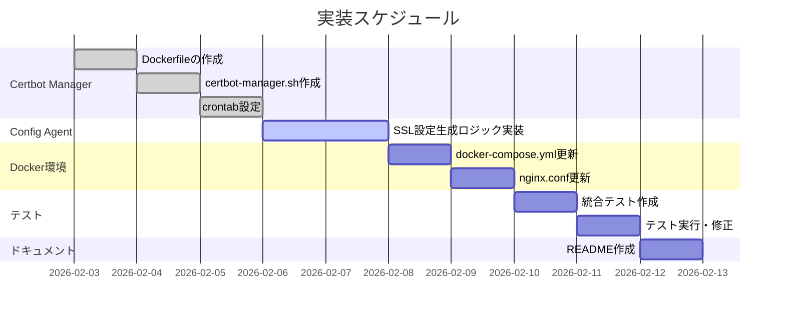

# Task 5.8: SSL/TLS証明書管理機能 - 実装計画

## 1. 概要

**設計書**: `docs/design/MWD-104-ssl-tls-architecture.md`

この実装計画は、設計書に基づいてSSL/TLS証明書管理機能を実装するための具体的な手順を定義します。

## 2. 実装フェーズ

### Phase 1: 基本機能実装（今回）



## 3. 実装タスク詳細

### Task 1: Certbot Manager Dockerサービスの作成

#### 3.1.1 ディレクトリ構造

```
certbot-manager/
├── Dockerfile
├── certbot-manager.sh
└── crontab
```

#### 3.1.2 Dockerfile実装

**ファイル**: `certbot-manager/Dockerfile`

**内容**:
```dockerfile
FROM certbot/certbot:v2.8.0

# 必要なパッケージをインストール
RUN apk add --no-cache \
    bash \
    docker-cli \
    tzdata

# タイムゾーン設定（JST）
ENV TZ=Asia/Tokyo

# スクリプトをコピー
COPY certbot-manager.sh /app/certbot-manager.sh
COPY crontab /etc/crontabs/root

# 実行権限を付与
RUN chmod +x /app/certbot-manager.sh

# ログディレクトリを作成
RUN mkdir -p /var/log

# crondをフォアグラウンドで実行
CMD ["crond", "-f", "-l", "2"]
```

**チェックリスト**:
- [ ] Certbot 2.8.0を使用
- [ ] bash、docker-cli、tzdataをインストール
- [ ] タイムゾーンをJSTに設定
- [ ] スクリプトに実行権限を付与
- [ ] crondをフォアグラウンドで実行

#### 3.1.3 certbot-manager.sh実装

**ファイル**: `certbot-manager/certbot-manager.sh`

**主要機能**:
1. 環境変数の検証
2. 初回証明書取得（`init`コマンド）
3. 証明書更新（`renew`コマンド）
4. テストモード（`test`コマンド）
5. バージョン確認（`version`コマンド）

**入力検証関数**:
```bash
validate_email() {
    local email="$1"
    if [[ ! "$email" =~ ^[a-zA-Z0-9._%+-]+@[a-zA-Z0-9.-]+\.[a-zA-Z]{2,}$ ]]; then
        echo "❌ エラー: 無効なメールアドレス形式: $email" >&2
        return 1
    fi
}

validate_domain() {
    local domain="$1"
    if [[ ! "$domain" =~ ^[a-zA-Z0-9.-]+\.[a-zA-Z]{2,}$ ]]; then
        echo "❌ エラー: 無効なドメイン形式: $domain" >&2
        return 1
    fi
}

validate_container_name() {
    local name="$1"
    if [[ ! "$name" =~ ^[a-zA-Z0-9][a-zA-Z0-9_.-]*$ ]]; then
        echo "❌ エラー: 無効なコンテナ名: $name" >&2
        return 1
    fi
}
```

**チェックリスト**:
- [ ] `set -euo pipefail`を設定
- [ ] 入力検証関数を実装
- [ ] `init`コマンドの実装
- [ ] `renew`コマンドの実装（`--deploy-hook`使用）
- [ ] コマンドインジェクション対策（配列使用）
- [ ] エラーハンドリングの実装
- [ ] ログ記録の実装

#### 3.1.4 crontab設定

**ファイル**: `certbot-manager/crontab`

**内容**:
```cron
# 毎日 18:00 UTC（3:00 AM JST）基準で証明書更新チェック
# ランダム待機時間（0〜60分）を追加し、Let's Encryptサーバーへの負荷を分散
0 18 * * * sleep $(shuf -i 0-3600 -n 1); /app/certbot-manager.sh renew >> /var/log/certbot-manager.log 2>&1
```

**チェックリスト**:
- [ ] 毎日18:00 UTCに実行
- [ ] ランダム待機時間（0〜3600秒）を追加
- [ ] ログを`/var/log/certbot-manager.log`に出力

---

### Task 2: ConfigAgentのSSL設定生成ロジック実装

#### 3.2.1 nginx-config-generator.sh拡張

**ファイル**: `config-agent/lib/nginx-config-generator.sh`

**新規関数**: `generate_ssl_config()`

**実装内容**:
```bash
generate_ssl_config() {
    local fqdn="$1"
    local cert_path="/etc/letsencrypt/live/${fqdn}"
    
    # 証明書の存在確認
    if [ -f "${cert_path}/fullchain.pem" ]; then
        cat << EOF
    # SSL証明書設定
    ssl_certificate ${cert_path}/fullchain.pem;
    ssl_certificate_key ${cert_path}/privkey.pem;
    ssl_trusted_certificate ${cert_path}/chain.pem;
    
    # SSL/TLSプロトコル設定
    ssl_protocols TLSv1.2 TLSv1.3;
    ssl_prefer_server_ciphers on;
    ssl_ciphers 'ECDHE-ECDSA-AES128-GCM-SHA256:ECDHE-RSA-AES128-GCM-SHA256:ECDHE-ECDSA-AES256-GCM-SHA384:ECDHE-RSA-AES256-GCM-SHA384';
    
    # OCSP Stapling
    ssl_stapling on;
    ssl_stapling_verify on;
    resolver 127.0.0.11 valid=300s; # Docker内部DNSリゾルバを利用
    
    # HSTS
    add_header Strict-Transport-Security "max-age=31536000; includeSubDomains" always;
    
    # セキュリティヘッダー
    add_header X-Frame-Options "SAMEORIGIN" always;
    add_header X-Content-Type-Options "nosniff" always;
    # 注: X-XSS-Protectionは非推奨のため除外（将来的にContent-Security-Policyを導入予定）
EOF
    else
        echo ""
    fi
}
```

**新規関数**: `generate_http_redirect_config()`

**実装内容**:
```bash
generate_http_redirect_config() {
    local fqdn="$1"
    local config_file="$2"
    
    cat > "$config_file" << EOF
# HTTP設定: ${fqdn}
# ACME Challenge + HTTPS リダイレクト

server {
    listen 80;
    server_name ${fqdn};
    
    # ACME Challenge用ディレクトリ
    location ^~ /.well-known/acme-challenge/ {
        root /var/www/certbot;
        default_type "text/plain";
        allow all;
    }
    
    # HTTP→HTTPSリダイレクト
    location / {
        return 301 https://\$host\$request_uri;
    }
}
EOF
}
```

**チェックリスト**:
- [ ] `generate_ssl_config()`関数を実装
- [ ] `generate_http_redirect_config()`関数を実装
- [ ] 証明書の存在確認を実装
- [ ] セキュアなTLS設定を生成
- [ ] ACME Challenge用の設定を生成

---

### Task 3: docker-compose.ymlの更新

#### 3.3.1 修正内容

**ファイル**: `docker/docker-compose.yml`

**追加内容**:
```yaml
services:
  nginx:
    # ... 既存設定 ...
    volumes:
      # ... 既存ボリューム ...
      - certbot-data:/etc/letsencrypt:ro
      - certbot-webroot:/var/www/certbot:ro
    ports:
      - "80:80"
      - "443:443"  # HTTPS用ポート追加
  
  certbot-manager:
    build:
      context: ../certbot-manager
      dockerfile: Dockerfile
    volumes:
      - certbot-data:/etc/letsencrypt:rw
      - certbot-webroot:/var/www/certbot:rw
      - /var/run/docker.sock:/var/run/docker.sock:rw  # docker execに必要
    environment:
      - EMAIL=${CERTBOT_EMAIL}
      - NGINX_CONTAINER_NAME=mwd-nginx
      - DOMAINS=${CERTBOT_DOMAINS}
      - STAGING=${CERTBOT_STAGING:-false}
    # セキュリティ注意: Dockerソケットへの書き込みアクセスは、
    # コンテナにホストのDocker APIへの完全なアクセスを与えます。
    # 本番環境では、より制限的なアクセス制御を検討してください。

volumes:
  certbot-data:
    driver: local
  certbot-webroot:
    driver: local
```

**チェックリスト**:
- [ ] `certbot-manager`サービスを追加
- [ ] `certbot-data`ボリュームを追加
- [ ] `certbot-webroot`ボリュームを追加
- [ ] Nginxに443ポートを追加
- [ ] Nginxにcertbotボリュームをマウント
- [ ] セキュリティ注意を追記

---

### Task 4: nginx.confのSSL/TLS設定追加

#### 3.4.1 修正内容

**ファイル**: `docker/nginx/nginx.conf`

**追加内容**:
```nginx
http {
    # ... 既存設定 ...
    
    # SSL/TLSセッション設定
    ssl_session_cache shared:SSL:10m;
    ssl_session_timeout 10m;
    ssl_session_tickets off;
    
    # ... 既存設定 ...
}
```

**チェックリスト**:
- [ ] SSLセッションキャッシュを設定
- [ ] セッションタイムアウトを設定
- [ ] セッションチケットを無効化（セキュリティ）

---

### Task 5: 統合テストスクリプトの作成

#### 3.5.1 test-ssl-tls.sh実装

**ファイル**: `scripts/openappsec/test-ssl-tls.sh`

**テストケース**:
1. 初回証明書取得テスト（ステージング環境）
2. HTTPS接続テスト
3. HTTP→HTTPSリダイレクトテスト
4. 証明書有効性テスト
5. セキュリティヘッダーテスト

**実装例**:
```bash
#!/bin/bash
set -e

test_https_connection() {
    local fqdn="$1"
    echo "🔍 HTTPS接続テスト: $fqdn"
    
    if curl -I "https://$fqdn/health" 2>&1 | grep -q "200 OK"; then
        echo "✅ HTTPS接続成功"
    else
        echo "❌ HTTPS接続失敗"
        return 1
    fi
}

test_http_redirect() {
    local fqdn="$1"
    echo "🔍 HTTP→HTTPSリダイレクトテスト: $fqdn"
    
    if curl -I "http://$fqdn/" 2>&1 | grep -q "301 Moved Permanently"; then
        echo "✅ HTTPリダイレクト成功"
    else
        echo "❌ HTTPリダイレクト失敗"
        return 1
    fi
}

test_certificate_validity() {
    local fqdn="$1"
    echo "🔍 証明書有効性テスト: $fqdn"
    
    if echo | openssl s_client -connect "$fqdn:443" -servername "$fqdn" 2>/dev/null | openssl x509 -noout -dates; then
        echo "✅ 証明書有効"
    else
        echo "❌ 証明書無効"
        return 1
    fi
}

test_security_headers() {
    local fqdn="$1"
    echo "🔍 セキュリティヘッダーテスト: $fqdn"
    
    local headers=$(curl -I -k "https://$fqdn/" 2>&1)
    
    if echo "$headers" | grep -q "Strict-Transport-Security"; then
        echo "✅ HSTSヘッダー確認"
    else
        echo "❌ HSTSヘッダーなし"
        return 1
    fi
    
    if echo "$headers" | grep -q "X-Frame-Options"; then
        echo "✅ X-Frame-Optionsヘッダー確認"
    else
        echo "❌ X-Frame-Optionsヘッダーなし"
        return 1
    fi
}
```

**チェックリスト**:
- [ ] HTTPS接続テストを実装
- [ ] HTTP→HTTPSリダイレクトテストを実装
- [ ] 証明書有効性テストを実装
- [ ] セキュリティヘッダーテストを実装
- [ ] テスト結果のログ出力を実装

---

### Task 6: ドキュメント作成

#### 3.6.1 README-TASK-5-8.md作成

**ファイル**: `README-TASK-5-8.md`

**内容**:
- 概要
- 実装内容
- クイックスタート
- 使用方法
- トラブルシューティング
- 次のステップ

**チェックリスト**:
- [ ] 概要を記載
- [ ] 実装内容を記載
- [ ] クイックスタートガイドを記載
- [ ] 使用方法を記載
- [ ] トラブルシューティングを記載
- [ ] 次のステップを記載

---

### Task 7: 統合テストの実行とCI通過確認

#### 3.7.1 テスト実行手順

1. **ローカル環境でのテスト**
   ```bash
   # 環境変数設定
   export CERTBOT_EMAIL="admin@example.com"
   export CERTBOT_DOMAINS="test.example.com"
   export CERTBOT_STAGING="true"
   
   # Dockerイメージビルド
   cd docker
   docker-compose build certbot-manager
   
   # サービス起動
   docker-compose up -d
   
   # 初回証明書取得
   docker exec mwd-certbot-manager /app/certbot-manager.sh init
   
   # テスト実行
   ./scripts/openappsec/test-ssl-tls.sh --fqdn test.example.com
   ```

2. **CI/CDでのテスト**
   - GitHub Actionsで自動テスト実行
   - ステージング環境での検証

**チェックリスト**:
- [ ] ローカル環境でテストを実行
- [ ] すべてのテストがパス
- [ ] CI/CDでテストがパス
- [ ] ステージング環境で検証

---

## 4. 実装スケジュール

| タスク | 予想時間 | 優先度 | 依存関係 |
|--------|---------|--------|---------|
| Task 1: Certbot Manager | 4時間 | High | - |
| Task 2: ConfigAgent拡張 | 3時間 | High | Task 1 |
| Task 3: docker-compose更新 | 1時間 | High | Task 1, 2 |
| Task 4: nginx.conf更新 | 1時間 | Medium | Task 3 |
| Task 5: テストスクリプト | 2時間 | High | Task 1-4 |
| Task 6: ドキュメント | 2時間 | Medium | Task 1-5 |
| Task 7: 統合テスト | 2時間 | High | Task 1-6 |

**合計予想時間**: 15時間

---

## 5. リスクと対策

### 5.1 技術的リスク

| リスク | 影響度 | 発生確率 | 対策 |
|--------|--------|---------|------|
| Let's Encryptレート制限 | High | Low | ステージング環境で十分テスト |
| 証明書取得失敗 | High | Medium | エラーハンドリングの実装、ログ記録 |
| Nginx設定エラー | Medium | Low | 設定検証の実装 |
| Dockerソケット権限エラー | Medium | Low | 権限設定の明確化、ドキュメント化 |

### 5.2 対策の実装

1. **ステージング環境の使用**
   - `CERTBOT_STAGING=true`で開発・テスト
   - 本番デプロイ前に十分な検証

2. **エラーハンドリング**
   - すべてのCertbotコマンドでエラーチェック
   - 失敗時のログ記録とアラート

3. **設定検証**
   - Nginx設定の構文チェック（`nginx -t`）
   - 証明書の有効性チェック

4. **権限管理**
   - Dockerソケットの権限を明確化
   - セキュリティリスクの文書化

---

## 6. 完了基準

### 6.1 機能完了基準

- [ ] Certbot Managerサービスが正常に起動する
- [ ] 初回証明書取得が成功する（ステージング環境）
- [ ] 証明書の自動更新が動作する
- [ ] ConfigAgentがSSL設定を生成する
- [ ] HTTP→HTTPSリダイレクトが動作する
- [ ] HTTPS接続が成功する
- [ ] セキュリティヘッダーが設定される

### 6.2 品質完了基準

- [ ] すべてのユニットテストがパス
- [ ] すべての統合テストがパス
- [ ] CI/CDがパス
- [ ] ドキュメントが完成
- [ ] コードレビューがパス

### 6.3 運用完了基準

- [ ] ステージング環境での動作確認
- [ ] ログとモニタリングの設定
- [ ] トラブルシューティングガイドの作成
- [ ] 運用手順書の作成

---

## 7. 参考資料

- **設計書**: `docs/design/MWD-104-ssl-tls-architecture.md`
- **Task 5.5 (GeoIP)参考**: `README-TASK-5-5.md`
- **Let's Encrypt Documentation**: https://letsencrypt.org/docs/
- **Certbot Documentation**: https://eff-certbot.readthedocs.io/
- **Nginx SSL Module**: https://nginx.org/en/docs/http/ngx_http_ssl_module.html

---

**作成日**: 2026-02-03  
**更新日**: 2026-02-03  
**バージョン**: 1.0.0  
**ステータス**: Ready for Implementation
