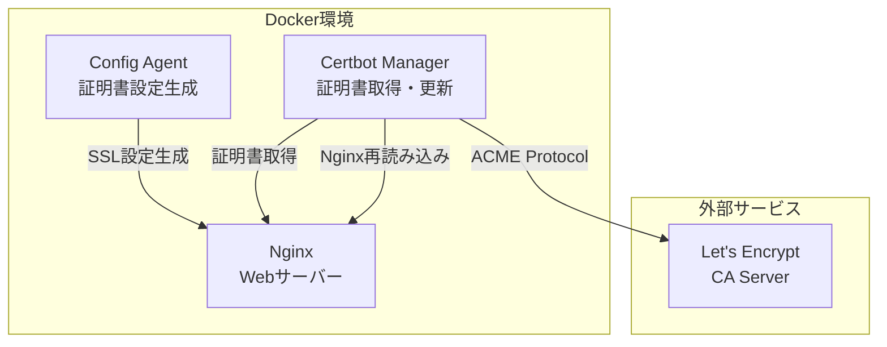
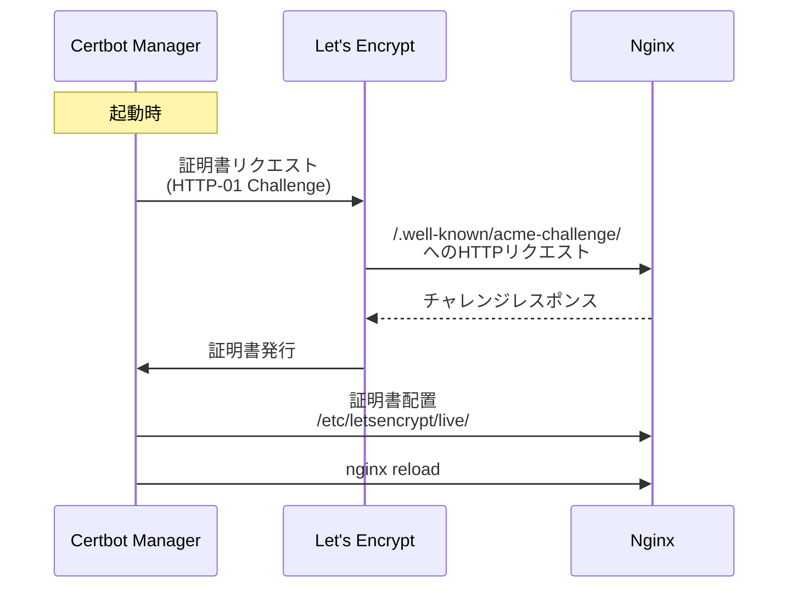
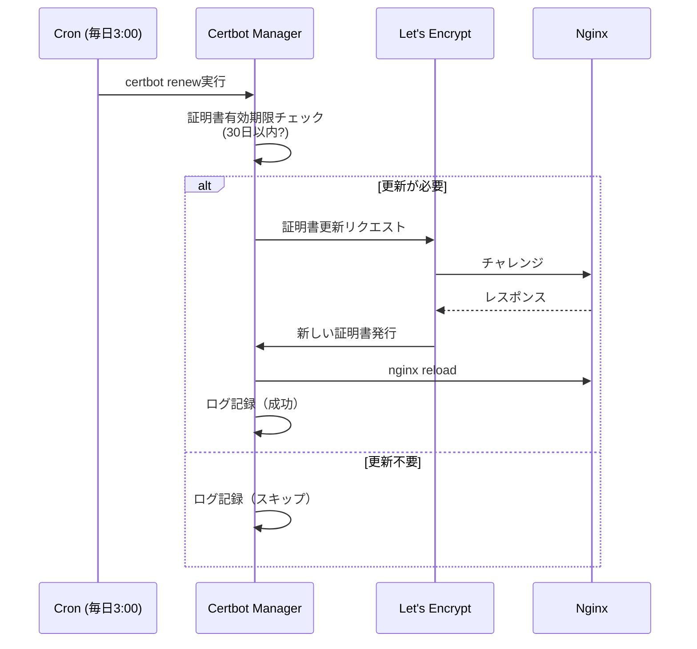

# Task 5.8: SSL/TLS証明書管理機能実装 - 設計書

## 1. 概要

### 1.1 目的

各FQDNごとにSSL/TLS証明書を自動的に取得・更新する機能を実装します。Let's Encryptを使用して無料のSSL証明書を取得し、Certbotによる自動更新を実現します。

### 1.2 背景

- **現状**: HTTPのみのサポート、SSL/TLS証明書管理が手動
- **課題**: HTTPS対応が必須、証明書の有効期限管理が煩雑
- **解決**: Certbotを使用した自動証明書取得・更新機能の実装

### 1.3 スコープ

#### 対象
- ✅ Let's Encrypt証明書の自動取得
- ✅ FQDN別の証明書管理
- ✅ 証明書の自動更新（cron）
- ✅ Nginx HTTPS設定の自動生成
- ✅ HTTP→HTTPSリダイレクト設定

#### 対象外
- ❌ ワイルドカード証明書（Phase 2で対応）
- ❌ カスタムCA証明書のインポート（Phase 2で対応）
- ❌ 証明書の手動アップロード機能（Phase 2で対応）

## 2. アーキテクチャ設計

### 2.1 全体構成



### 2.2 コンポーネント設計

#### 2.2.1 Certbot Manager Service

**役割**: Let's Encrypt証明書の取得・更新を自動化

**機能**:
- 初回証明書取得（HTTP-01 Challenge）
- 証明書の自動更新（cronによる定期実行）
- Nginx設定の動的更新
- 証明書の検証とエラーハンドリング

**実装ファイル**:
- `certbot-manager/certbot-manager.sh` - メインスクリプト
- `certbot-manager/Dockerfile` - Dockerイメージ
- `certbot-manager/crontab` - cron設定

#### 2.2.2 Config Agent拡張

**役割**: SSL/TLS設定をNginx設定ファイルに反映

**機能**:
- SSL証明書パスの設定
- HTTP→HTTPSリダイレクト設定
- SSL/TLSプロトコル・暗号スイートの設定
- HSTS（HTTP Strict Transport Security）設定

**実装ファイル**:
- `config-agent/lib/nginx-config-generator.sh` - 拡張

#### 2.2.3 Nginx設定

**役割**: HTTPS通信の提供

**機能**:
- ポート443でのHTTPSリスニング
- SSL証明書の読み込み
- セキュアなTLS設定

## 3. データフロー

### 3.1 初回証明書取得フロー



### 3.2 証明書更新フロー



## 4. 技術仕様

### 4.1 使用技術

| コンポーネント | 技術 | バージョン |
|---------------|------|-----------|
| SSL/TLS証明書 | Let's Encrypt | - |
| 証明書管理ツール | Certbot | 2.8.0 |
| Webサーバー | Nginx | 1.24+ |
| OS | Alpine Linux | 3.18+ |
| スケジューラー | cron | - |

### 4.2 ディレクトリ構造

```
MrWebDefence-Engine/
├── certbot-manager/
│   ├── Dockerfile
│   ├── certbot-manager.sh       # メインスクリプト
│   └── crontab                  # cron設定
├── docker/
│   ├── docker-compose.yml       # certbot-managerサービス追加
│   └── nginx/
│       ├── conf.d/
│       │   └── *.conf           # HTTPS設定含む
│       └── nginx.conf           # SSL設定
└── config-agent/
    └── lib/
        └── nginx-config-generator.sh  # SSL設定生成ロジック追加
```

### 4.3 Docker Compose設定

```yaml
services:
  nginx:
    volumes:
      - certbot-data:/etc/letsencrypt:ro
      - certbot-webroot:/var/www/certbot:ro
    ports:
      - "80:80"
      - "443:443"
  
  certbot-manager:
    build:
      context: ../certbot-manager
      dockerfile: Dockerfile
    volumes:
      - certbot-data:/etc/letsencrypt:rw
      - certbot-webroot:/var/www/certbot:rw
      - /var/run/docker.sock:/var/run/docker.sock:ro
    environment:
      - EMAIL=${CERTBOT_EMAIL}
      - NGINX_CONTAINER_NAME=mwd-nginx
      - DOMAINS=${CERTBOT_DOMAINS}
      - STAGING=${CERTBOT_STAGING:-false}

volumes:
  certbot-data:
    driver: local
  certbot-webroot:
    driver: local
```

### 4.4 環境変数

| 変数名 | 説明 | 必須 | デフォルト値 | 例 |
|--------|------|------|------------|-----|
| `CERTBOT_EMAIL` | Let's Encrypt通知用メール | ✅ | - | `admin@example.com` |
| `CERTBOT_DOMAINS` | 証明書取得対象FQDN（カンマ区切り） | ✅ | - | `example.com,test.example.com` |
| `CERTBOT_STAGING` | Let's Encryptステージング環境使用 | ❌ | `false` | `true` / `false` |
| `NGINX_CONTAINER_NAME` | Nginxコンテナ名 | ✅ | `mwd-nginx` | `mwd-nginx` |
| `CERT_RENEWAL_HOUR` | 証明書更新実行時刻 | ❌ | `3` | `3` (3:00 AM) |

## 5. Nginx設定生成

### 5.1 HTTP設定（ポート80）

#### 目的
- ACME Challengeの提供（`.well-known/acme-challenge/`）
- HTTP→HTTPSリダイレクト

#### 生成される設定例

```nginx
server {
    listen 80;
    server_name example.com;
    
    # ACME Challenge用ディレクトリ
    location ^~ /.well-known/acme-challenge/ {
        root /var/www/certbot;
        default_type "text/plain";
        allow all;
    }
    
    # HTTP→HTTPSリダイレクト
    location / {
        return 301 https://$host$request_uri;
    }
}
```

### 5.2 HTTPS設定（ポート443）

#### 目的
- HTTPS通信の提供
- セキュアなTLS設定
- バックエンドへのプロキシ

#### 生成される設定例

```nginx
server {
    listen 443 ssl http2;
    server_name example.com;
    
    # SSL証明書設定
    ssl_certificate /etc/letsencrypt/live/example.com/fullchain.pem;
    ssl_certificate_key /etc/letsencrypt/live/example.com/privkey.pem;
    ssl_trusted_certificate /etc/letsencrypt/live/example.com/chain.pem;
    
    # SSL/TLSプロトコル設定
    ssl_protocols TLSv1.2 TLSv1.3;
    ssl_prefer_server_ciphers on;
    ssl_ciphers 'ECDHE-ECDSA-AES128-GCM-SHA256:ECDHE-RSA-AES128-GCM-SHA256:ECDHE-ECDSA-AES256-GCM-SHA384:ECDHE-RSA-AES256-GCM-SHA384';
    
    # OCSP Stapling
    ssl_stapling on;
    ssl_stapling_verify on;
    resolver 8.8.8.8 8.8.4.4 valid=300s;
    resolver_timeout 5s;
    
    # HSTS (HTTP Strict Transport Security)
    add_header Strict-Transport-Security "max-age=31536000; includeSubDomains" always;
    
    # セキュリティヘッダー
    add_header X-Frame-Options "SAMEORIGIN" always;
    add_header X-Content-Type-Options "nosniff" always;
    add_header X-XSS-Protection "1; mode=block" always;
    
    # アクセスログ
    access_log /var/log/nginx/example.com/access.log json_combined;
    error_log /var/log/nginx/example.com/error.log warn;
    
    location / {
        proxy_pass http://backend-server:80;
        proxy_set_header Host $host;
        proxy_set_header X-Real-IP $remote_addr;
        proxy_set_header X-Forwarded-For $proxy_add_x_forwarded_for;
        proxy_set_header X-Forwarded-Proto $scheme;
    }
}
```

### 5.3 ConfigAgent生成ロジック

#### 新規関数: `generate_ssl_config()`

```bash
generate_ssl_config() {
    local fqdn="$1"
    local cert_path="/etc/letsencrypt/live/${fqdn}"
    
    # 証明書の存在確認
    if [ -f "${cert_path}/fullchain.pem" ]; then
        # HTTPS設定を生成
        cat << EOF
    # SSL証明書設定
    ssl_certificate ${cert_path}/fullchain.pem;
    ssl_certificate_key ${cert_path}/privkey.pem;
    ssl_trusted_certificate ${cert_path}/chain.pem;
    
    # SSL/TLSプロトコル設定
    ssl_protocols TLSv1.2 TLSv1.3;
    ssl_prefer_server_ciphers on;
    ssl_ciphers 'ECDHE-ECDSA-AES128-GCM-SHA256:ECDHE-RSA-AES128-GCM-SHA256:ECDHE-ECDSA-AES256-GCM-SHA384:ECDHE-RSA-AES256-GCM-SHA384';
    
    # OCSP Stapling
    ssl_stapling on;
    ssl_stapling_verify on;
    resolver 127.0.0.11 valid=300s; # Docker内部DNSリゾルバを利用
    
    # HSTS
    add_header Strict-Transport-Security "max-age=31536000; includeSubDomains" always;
    
    # セキュリティヘッダー
    add_header X-Frame-Options "SAMEORIGIN" always;
    add_header X-Content-Type-Options "nosniff" always;
    add_header X-XSS-Protection "1; mode=block" always;
EOF
    else
        # 証明書がない場合は空文字列を返す
        echo ""
    fi
}
```

## 6. Certbot Managerスクリプト仕様

### 6.1 `certbot-manager.sh`の機能

#### コマンド

| コマンド | 説明 | 用途 |
|---------|------|------|
| `init` | 初回証明書取得 | 初回セットアップ時 |
| `renew` | 証明書更新 | cron定期実行 |
| `test` | 設定確認 | デバッグ時 |
| `version` | バージョン確認 | デバッグ時 |

#### 処理フロー（`init`コマンド）

1. 環境変数の検証
2. ドメインリストのパース
3. 各ドメインに対してCertbot実行
   - HTTP-01 Challenge使用
   - Webrootモード（`/var/www/certbot`）
4. 証明書取得成功/失敗のログ記録
5. Nginx再読み込み

#### 処理フロー（`renew`コマンド）

1. `certbot renew --quiet`実行
2. 更新があった場合、Nginx再読み込み
3. ログ記録

#### エラーハンドリング

| エラー | 対応 |
|--------|------|
| 環境変数未設定 | エラーメッセージ表示、終了コード1 |
| Certbot実行失敗 | ログ記録、次のドメインへ継続 |
| Nginxリロード失敗 | エラーログ記録、終了コード1 |
| ドメイン検証失敗 | ログ記録、ステージング環境推奨メッセージ |

### 6.2 セキュリティ考慮事項

#### 入力検証

```bash
validate_email() {
    local email="$1"
    if [[ ! "$email" =~ ^[a-zA-Z0-9._%+-]+@[a-zA-Z0-9.-]+\.[a-zA-Z]{2,}$ ]]; then
        echo "❌ エラー: 無効なメールアドレス形式: $email" >&2
        return 1
    fi
}

validate_domain() {
    local domain="$1"
    if [[ ! "$domain" =~ ^[a-zA-Z0-9.-]+\.[a-zA-Z]{2,}$ ]]; then
        echo "❌ エラー: 無効なドメイン形式: $domain" >&2
        return 1
    fi
}

validate_container_name() {
    local name="$1"
    if [[ ! "$name" =~ ^[a-zA-Z0-9][a-zA-Z0-9_.-]*$ ]]; then
        echo "❌ エラー: 無効なコンテナ名: $name" >&2
        return 1
    fi
}
```

#### コマンドインジェクション対策

```bash
# ❌ 危険: 変数を直接展開
docker exec $NGINX_CONTAINER_NAME nginx -s reload

# ✅ 安全: 配列を使用
declare -a cmd=("docker" "exec" "$NGINX_CONTAINER_NAME" "nginx" "-s" "reload")
"${cmd[@]}"
```

## 7. cron設定

### 7.1 証明書更新スケジュール

```cron
# 毎日 3:00 AM JST（前日18:00 UTC）に証明書更新チェック
0 18 * * * /app/certbot-manager.sh renew >> /var/log/certbot-manager.log 2>&1
```

### 7.2 Let's Encryptの制限

| 制限 | 値 | 備考 |
|------|---|------|
| 証明書発行レート制限 | 50件/週/登録ドメイン | ステージング環境で十分テスト |
| 重複証明書レート制限 | 5件/週/ドメインセット | 同じドメインセットでの再発行制限 |
| 証明書有効期限 | 90日 | 30日以内に更新推奨 |

## 8. テスト戦略

### 8.1 ユニットテスト

#### 対象
- `certbot-manager.sh`の各関数
- 入力検証関数
- Nginx設定生成関数（ConfigAgent）

#### テストケース例

```bash
# test_certbot_manager.sh

test_validate_email() {
    validate_email "test@example.com" && echo "✅ PASS" || echo "❌ FAIL"
    validate_email "invalid-email" && echo "❌ FAIL" || echo "✅ PASS"
}

test_validate_domain() {
    validate_domain "example.com" && echo "✅ PASS" || echo "❌ FAIL"
    validate_domain "test.example.com" && echo "✅ PASS" || echo "❌ FAIL"
    validate_domain "invalid_domain" && echo "❌ FAIL" || echo "✅ PASS"
}
```

### 8.2 統合テスト

#### テストシナリオ

1. **初回証明書取得テスト**
   - 前提: 証明書が存在しない
   - 実行: `certbot-manager.sh init`
   - 検証: 証明書が`/etc/letsencrypt/live/`に作成される

2. **HTTPS接続テスト**
   - 前提: 証明書が取得済み
   - 実行: `curl https://example.com/health`
   - 検証: ステータスコード200、SSL証明書が有効

3. **HTTP→HTTPSリダイレクトテスト**
   - 前提: HTTPS設定が有効
   - 実行: `curl -I http://example.com/`
   - 検証: ステータスコード301、Locationヘッダーが`https://`

4. **証明書更新テスト**
   - 前提: 証明書が有効期限30日以内
   - 実行: `certbot-manager.sh renew`
   - 検証: 新しい証明書が取得される

5. **ステージング環境テスト**
   - 前提: `CERTBOT_STAGING=true`
   - 実行: `certbot-manager.sh init`
   - 検証: ステージング証明書が取得される（レート制限回避）

### 8.3 テストスクリプト

`scripts/openappsec/test-ssl-tls.sh`

```bash
#!/bin/bash
# SSL/TLS証明書管理機能の統合テストスクリプト

test_https_connection() {
    local fqdn="$1"
    echo "🔍 HTTPS接続テスト: $fqdn"
    
    if curl -I "https://$fqdn/health" 2>&1 | grep -q "200 OK"; then
        echo "✅ HTTPS接続成功"
    else
        echo "❌ HTTPS接続失敗"
        return 1
    fi
}

test_http_redirect() {
    local fqdn="$1"
    echo "🔍 HTTP→HTTPSリダイレクトテスト: $fqdn"
    
    if curl -I "http://$fqdn/" 2>&1 | grep -q "301 Moved Permanently"; then
        echo "✅ HTTPリダイレクト成功"
    else
        echo "❌ HTTPリダイレクト失敗"
        return 1
    fi
}

test_certificate_validity() {
    local fqdn="$1"
    echo "🔍 証明書有効性テスト: $fqdn"
    
    if echo | openssl s_client -connect "$fqdn:443" -servername "$fqdn" 2>/dev/null | openssl x509 -noout -dates; then
        echo "✅ 証明書有効"
    else
        echo "❌ 証明書無効"
        return 1
    fi
}
```

## 9. モニタリングとアラート

### 9.1 監視項目

| 項目 | 説明 | 重要度 |
|------|------|--------|
| 証明書有効期限 | 30日以内に警告、7日以内に緊急 | 🔴 Critical |
| 証明書更新失敗 | `certbot renew`の失敗 | 🔴 Critical |
| HTTPS接続エラー | 443ポートの接続失敗 | 🟡 Warning |
| Nginxリロード失敗 | 設定エラー | 🔴 Critical |

### 9.2 ログフォーマット

```
[2026-02-03 15:00:00] [INFO] 証明書更新開始: example.com
[2026-02-03 15:00:05] [INFO] 証明書更新成功: example.com (有効期限: 2026-05-04)
[2026-02-03 15:00:06] [INFO] Nginx再読み込み成功
[2026-02-03 15:00:06] [INFO] 証明書更新完了
```

## 10. セキュリティベストプラクティス

### 10.1 TLS設定

```nginx
# 推奨設定
ssl_protocols TLSv1.2 TLSv1.3;
ssl_prefer_server_ciphers on;
ssl_ciphers 'ECDHE-ECDSA-AES128-GCM-SHA256:ECDHE-RSA-AES128-GCM-SHA256:ECDHE-ECDSA-AES256-GCM-SHA384:ECDHE-RSA-AES256-GCM-SHA384';
ssl_session_cache shared:SSL:10m;
ssl_session_timeout 10m;
```

### 10.2 HSTSヘッダー

```nginx
# HTTP Strict Transport Security
add_header Strict-Transport-Security "max-age=31536000; includeSubDomains" always;
```

### 10.3 証明書の権限設定

```bash
# Certbotが作成するファイルの権限
chown -R root:root /etc/letsencrypt
chmod 755 /etc/letsencrypt/live
chmod 644 /etc/letsencrypt/live/*/fullchain.pem
chmod 600 /etc/letsencrypt/live/*/privkey.pem
```

## 11. トラブルシューティング

### 11.1 よくある問題

#### 問題1: ACME Challenge失敗

**症状**:
```
Challenge failed for domain example.com
```

**原因**:
- Nginx設定でACME Challengeパスが正しく設定されていない
- ファイアウォールでポート80がブロックされている
- DNSレコードが正しくない

**対処方法**:
```bash
# 1. Nginx設定確認
docker exec mwd-nginx cat /etc/nginx/conf.d/example.com.conf

# 2. ポート80確認
curl http://example.com/.well-known/acme-challenge/test

# 3. DNSレコード確認
dig example.com
```

#### 問題2: 証明書更新失敗

**症状**:
```
Cert not yet due for renewal
```

**原因**: 証明書の有効期限が30日以上残っている

**対処方法**: 強制更新
```bash
# 注意: レート制限に抵触する可能性があるため、テスト環境での使用を推奨
docker exec mwd-certbot-manager certbot renew --force-renewal
```

#### 問題3: Nginxリロード失敗

**症状**:
```
nginx: [emerg] cannot load certificate "/etc/letsencrypt/live/example.com/fullchain.pem"
```

**原因**: 証明書ファイルが存在しない、または権限がない

**対処方法**:
```bash
# 証明書確認
docker exec mwd-nginx ls -la /etc/letsencrypt/live/example.com/

# ボリューム確認
docker volume inspect docker_certbot-data
```

## 12. 実装フェーズ

### Phase 1: 基本機能実装（今回）

- ✅ Certbot Manager Dockerサービスの作成
- ✅ 初回証明書取得機能
- ✅ ConfigAgentのSSL設定生成拡張
- ✅ HTTP→HTTPSリダイレクト設定
- ✅ 証明書自動更新（cron）
- ✅ 統合テストスクリプト

### Phase 2: 拡張機能（将来）

- ❌ ワイルドカード証明書（DNS-01 Challenge）
- ❌ カスタムCA証明書のインポート
- ❌ 証明書の手動アップロード機能
- ❌ 証明書有効期限アラート（Prometheus/Grafana）
- ❌ マルチドメイン証明書（SAN）

## 13. 参考資料

- [Let's Encrypt Documentation](https://letsencrypt.org/docs/)
- [Certbot Documentation](https://eff-certbot.readthedocs.io/)
- [Nginx SSL Module](https://nginx.org/en/docs/http/ngx_http_ssl_module.html)
- [Mozilla SSL Configuration Generator](https://ssl-config.mozilla.org/)
- [OWASP TLS Cheat Sheet](https://cheatsheetseries.owasp.org/cheatsheets/Transport_Layer_Security_Cheat_Sheet.html)

## 14. 承認

| 項目 | ステータス | レビュアー | 日付 |
|------|-----------|----------|------|
| 設計レビュー | ⏳ 待機中 | - | - |
| セキュリティレビュー | ⏳ 待機中 | - | - |
| 実装承認 | ⏳ 待機中 | - | - |

---

**作成日**: 2026-02-03  
**更新日**: 2026-02-03  
**バージョン**: 1.0.0  
**ステータス**: Draft（設計レビュー待ち）
