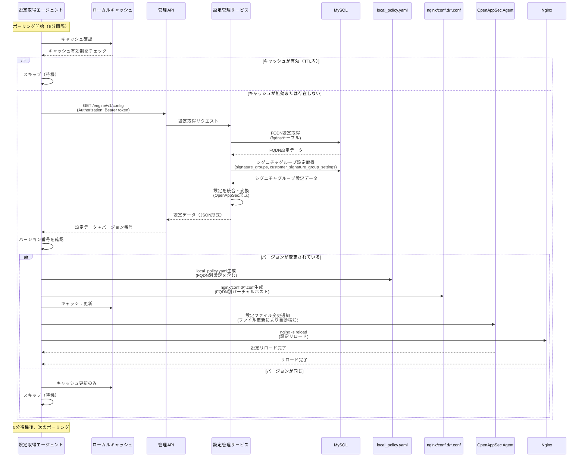
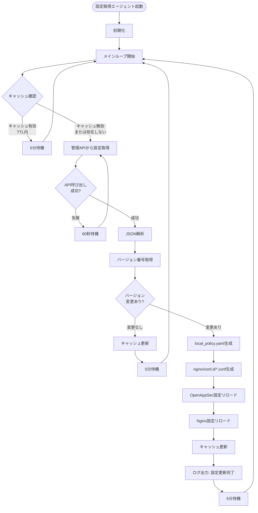
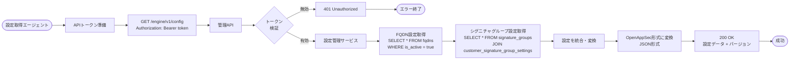
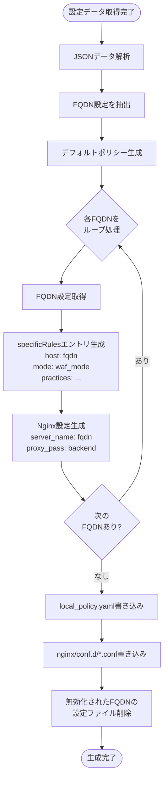
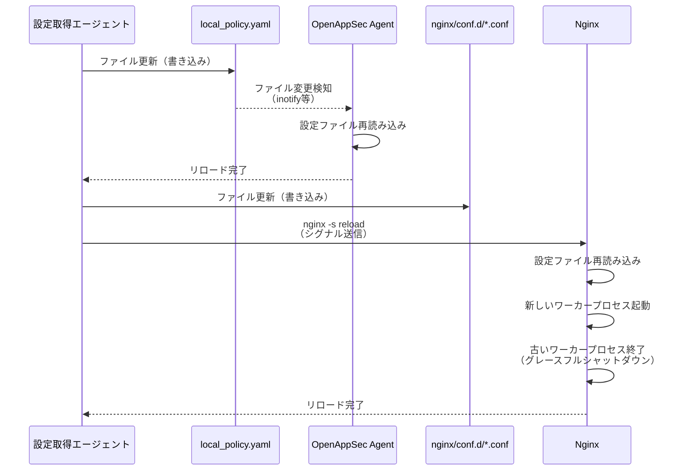

# Task 5.1: OpenAppSec統合 実装設計書

## 概要

OpenAppSecをベースとしてWAF（Web Application Firewall）機能を提供するための実装設計。設計書（MrWebDefence-Design/docs/DESIGN.md）に基づいて実装設計を定義します。

## 参照設計書

- **要件定義**: `MrWebDefence-Design/docs/REQUIREMENT.md`
- **仕様書**: `MrWebDefence-Design/docs/SPECIFICATION.md`
- **詳細設計**: `MrWebDefence-Design/docs/DESIGN.md`
- **OpenAppSec仕様**: `MrWebDefence-Design/docs/OPENAPPSEC_SPECIFICATION.md`
- **Epic・タスク設計**: `MrWebDefence-Design/docs/EPIC_TASK_DESIGN.md`

## 目的

- OpenAppSecのインストール・設定
- Nginxとの統合（共有メモリ使用）
- WAF機能の提供
- **1つのNginxで複数のFQDNを扱う**
- **FQDNごとに異なるWAF設定を適用する**
- **設定取得エージェントによる動的設定更新**

## アーキテクチャ概要

### システム構成

```
┌─────────────────────────────────────────────────────────┐
│              Client Requests (Multiple FQDNs)           │
│  - example1.com                                          │
│  - example2.com                                          │
│  - example3.com                                           │
└──────────────────────┬──────────────────────────────────┘
                       │
                       ▼
┌─────────────────────────────────────────────────────────┐
│              Nginx (with Attachment Module)            │
│  ┌──────────────────────────────────────────────────┐  │
│  │  ngx_cp_attachment_module.so                     │  │
│  │  - 複数FQDNのバーチャルホスト設定                 │  │
│  │  - FQDNごとのHTTP(S)トラフィックをキャプチャ      │  │
│  │  - OpenAppSec Agentと通信（FQDN情報付き）         │  │
│  │  - 共有メモリを使用                                │  │
│  └──────────────────────────────────────────────────┘  │
└──────────────────────┬──────────────────────────────────┘
                       │
                       │ 共有メモリ / IPC (FQDN情報付き)
                       ▼
┌─────────────────────────────────────────────────────────┐
│              OpenAppSec Agent Container                 │
│  ┌──────────────────────────────────────────────────┐  │
│  │  - FQDN別WAF設定の管理                            │  │
│  │  - FQDNごとのWAFロジック実行                      │  │
│  │  - MLモデルによる脅威検出（FQDN別）                │  │
│  │  - ブロック/許可判定（FQDN別設定適用）             │  │
│  └──────────────────────────────────────────────────┘  │
└──────────────────────┬──────────────────────────────────┘
                       │
                       │ 設定ファイル参照
                       ▼
┌─────────────────────────────────────────────────────────┐
│         ConfigAgent (設定取得エージェント)              │
│  ┌──────────────────────────────────────────────────┐  │
│  │  - 管理APIから設定取得（ポーリング5分間隔）       │  │
│  │  - local_policy.yaml生成・更新                    │  │
│  │  - Nginx設定ファイル生成・更新                    │  │
│  │  - 設定のバージョン管理                           │  │
│  │  - 設定のローカルキャッシュ（TTL: 5分）           │  │
│  └──────────────────────────────────────────────────┘  │
└──────────────────────┬──────────────────────────────────┘
                       │
                       │ HTTPS (APIトークン認証)
                       ▼
┌─────────────────────────────────────────────────────────┐
│              管理API (設定管理API)                      │
│  ┌──────────────────────────────────────────────────┐  │
│  │  GET /engine/v1/config                           │  │
│  │  - FQDN設定取得                                   │  │
│  │  - シグニチャグループ設定取得                     │  │
│  │  - OpenAppSec設定形式で返却                       │  │
│  └──────────────────────────────────────────────────┘  │
└──────────────────────┬──────────────────────────────────┘
                       │
                       │ MySQL Protocol
                       ▼
┌─────────────────────────────────────────────────────────┐
│                    MySQL Database                       │
│  - fqdnsテーブル                                        │
│  - signature_groupsテーブル                             │
│  - customer_signature_group_settingsテーブル            │
└─────────────────────────────────────────────────────────┘
```

### コンポーネント

1. **Nginx Attachment Module**
   - OpenAppSec提供のNGINXモジュール
   - HTTP(S)トラフィックをインターセプト
   - Agentと通信して判定結果を受信

2. **OpenAppSec Agent**
   - WAFエンジン
   - 機械学習モデルによる脅威検出
   - ブロック/許可の判定

3. **設定取得エージェント（ConfigAgent）**
   - **実装場所**: MrWebDefence-Engineリポジトリ
   - 管理APIから設定を取得（ポーリング、デフォルト5分間隔）
   - OpenAppSec設定ファイル（`local_policy.yaml`）を生成・更新
   - Nginx設定ファイルを生成・更新
   - 設定のバージョン管理
   - 設定のローカルキャッシュ（TTL: 5分）

4. **管理API（設定管理API）**
   - **実装場所**: MrWebDefence-Consoleリポジトリ
   - **言語**: TypeScript
   - **フレームワーク**: FastAPI/Gin/Express（設計書参照）
   - **エンドポイント**: `GET /engine/v1/config`
   - **認証**: APIトークン（`Authorization: Bearer <token>`）
   - **責務**: 
     - データベースからFQDN設定とシグニチャグループ設定を取得
     - OpenAppSec設定形式に変換して返却
     - WAFエンジン向けの設定配信

5. **共有メモリ（Shared Memory）**
   - NginxとAgent間の高速通信
   - セッション情報、リクエストメタデータの共有
   - パフォーマンス最適化

## リポジトリ構成とコンポーネントの関係

### リポジトリ構成

| リポジトリ名 | 言語 | 主な責務 | 本設計書での対象 |
|------------|------|---------|----------------|
| **MrWebDefence-Engine** | Shell | WAFエンジン（OpenAppSec統合） | ✅ 本リポジトリ |
| **MrWebDefence-Console** | TypeScript | 管理画面（フロントエンド・バックエンド） | ⚠️ 管理APIは別リポジトリ |
| **MrWebDefence-Design** | - | 設計・ドキュメント管理 | 📚 参照設計書 |

### コンポーネント間の関係

```
┌─────────────────────────────────────────────────────────┐
│  MrWebDefence-Engine (本リポジトリ)                    │
│  ┌──────────────────────────────────────────────────┐  │
│  │  - Nginx + OpenAppSec Agent                      │  │
│  │  - 設定取得エージェント（ConfigAgent）           │  │
│  │  - 設定ファイル生成・更新                        │  │
│  └──────────────────────────────────────────────────┘  │
└──────────────────────┬──────────────────────────────────┘
                       │
                       │ HTTPS (APIトークン認証)
                       │ GET /engine/v1/config
                       ▼
┌─────────────────────────────────────────────────────────┐
│  MrWebDefence-Console (別リポジトリ)                   │
│  ┌──────────────────────────────────────────────────┐  │
│  │  - 管理API（設定管理API）                        │  │
│  │  - バックエンドサービス（設定管理サービス）       │  │
│  │  - 管理画面（フロントエンド）                    │  │
│  └──────────────────────────────────────────────────┘  │
└──────────────────────┬──────────────────────────────────┘
                       │
                       │ MySQL Protocol
                       ▼
┌─────────────────────────────────────────────────────────┐
│  MySQL Database                                         │
│  - fqdnsテーブル                                        │
│  - signature_groupsテーブル                             │
│  - customer_signature_group_settingsテーブル            │
└─────────────────────────────────────────────────────────┘
```

### 注意事項

- **管理APIの実装**: 管理API（`GET /engine/v1/config`）は**MrWebDefence-Consoleリポジトリ**で実装されます
- **設定取得エージェント**: 本リポジトリ（MrWebDefence-Engine）で実装されます
- **接続設定**: 設定取得エージェントは環境変数`CONFIG_API_URL`で管理APIのURLを指定します
  - 例: `CONFIG_API_URL=https://console.example.com` または `http://config-api:8080`（同一Dockerネットワーク内の場合）

## 実装詳細

### 1. ディレクトリ構造

```
MrWebDefence-Engine/
├── docker/
│   ├── docker-compose.yml          # OpenAppSec統合構成
│   ├── nginx/
│   │   ├── nginx.conf              # Nginx設定（Attachment Module読み込み）
│   │   └── conf.d/                 # FQDN別バーチャルホスト設定（自動生成）
│   └── openappsec/
│       └── local_policy.yaml        # OpenAppSecポリシー設定（自動生成）
├── config-agent/
│   ├── config-agent.sh             # 設定取得エージェント（メインスクリプト）
│   ├── lib/
│   │   ├── api-client.sh           # 管理APIクライアント
│   │   ├── config-generator.sh     # 設定ファイル生成
│   │   ├── nginx-config-generator.sh  # Nginx設定生成
│   │   └── policy-generator.sh     # OpenAppSecポリシー生成
│   └── config/
│       └── config-agent.conf        # エージェント設定
├── scripts/
│   └── openappsec/
│       ├── install.sh               # OpenAppSecインストールスクリプト
│       ├── health-check.sh          # ヘルスチェックスクリプト
│       └── start-config-agent.sh   # 設定取得エージェント起動スクリプト
└── docs/
    └── design/
        └── MWD-38-openappsec-integration.md  # 本設計書
```

### 2. Docker Compose構成

```yaml
version: '3.8'

services:
  nginx:
    image: nginx:latest
    container_name: mwd-nginx
    volumes:
      - ./docker/nginx/nginx.conf:/etc/nginx/nginx.conf:ro
      - ./docker/nginx/conf.d:/etc/nginx/conf.d:ro
      - nginx-shm:/var/cache/nginx/shared
    ports:
      - "80:80"
      - "443:443"
    depends_on:
      - openappsec-agent
      - config-agent
    networks:
      - mwd-network
    restart: unless-stopped

  openappsec-agent:
    image: openappsec/agent:latest
    container_name: mwd-openappsec-agent
    volumes:
      - ./docker/openappsec/local_policy.yaml:/etc/openappsec/local_policy.yaml:ro
      - nginx-shm:/var/cache/nginx/shared
    environment:
      - OPENAPPSEC_LOG_LEVEL=info
      - OPENAPPSEC_POLICY_FILE=/etc/openappsec/local_policy.yaml
    networks:
      - mwd-network
    restart: unless-stopped

  config-agent:
    image: alpine:latest
    container_name: mwd-config-agent
    volumes:
      - ./config-agent:/app/config-agent:ro
      - ./docker/openappsec:/app/output/openappsec:rw
      - ./docker/nginx/conf.d:/app/output/nginx/conf.d:rw
    environment:
      - CONFIG_API_URL=${CONFIG_API_URL:-http://config-api:8080}
      - CONFIG_API_TOKEN=${CONFIG_API_TOKEN}
      - POLLING_INTERVAL=${POLLING_INTERVAL:-300}
      - CACHE_TTL=${CACHE_TTL:-300}
    command: /bin/sh -c "apk add --no-cache curl jq bash && /app/config-agent/config-agent.sh"
    networks:
      - mwd-network
    restart: unless-stopped

volumes:
  nginx-shm:
    driver: local

networks:
  mwd-network:
    driver: bridge
```

### 3. Nginx設定

#### nginx.conf

```nginx
# OpenAppSec Attachment Moduleの読み込み
load_module /usr/lib/nginx/modules/ngx_cp_attachment_module.so;

user nginx;
worker_processes auto;
error_log /var/log/nginx/error.log warn;
pid /var/run/nginx.pid;

events {
    worker_connections 1024;
    use epoll;
}

http {
    include /etc/nginx/mime.types;
    default_type application/octet-stream;

    # 共有メモリゾーンの設定
    # OpenAppSec用の共有メモリ
    openappsec_shared_memory_zone zone=openappsec_shm:10m;

    # ログ設定
    log_format main '$remote_addr - $remote_user [$time_local] "$request" '
                    '$status $body_bytes_sent "$http_referer" '
                    '"$http_user_agent" "$http_x_forwarded_for"';

    access_log /var/log/nginx/access.log main;

    # 基本設定
    sendfile on;
    tcp_nopush on;
    tcp_nodelay on;
    keepalive_timeout 65;
    types_hash_max_size 2048;

    # OpenAppSec設定
    openappsec_agent_url http://openappsec-agent:8080;
    openappsec_enabled on;

    # 設定ファイルの読み込み（FQDN別設定は自動生成される）
    include /etc/nginx/conf.d/*.conf;
}
```

#### conf.d/*.conf（自動生成）

設定取得エージェントが各FQDNごとに自動生成します。

### 4. OpenAppSec Agent設定

#### local_policy.yaml（自動生成）

設定取得エージェントが管理APIから取得した設定を基に自動生成します。

### 5. 設定取得エージェント（ConfigAgent）

#### 5.1 概要

設定取得エージェントは、管理APIからFQDN設定とシグニチャグループ設定を取得し、OpenAppSec設定ファイル（`local_policy.yaml`）とNginx設定ファイルを自動生成・更新します。

#### 5.2 設定取得フロー

##### 5.2.1 全体フロー



##### 5.2.2 設定取得エージェント内部フロー



##### 5.2.3 管理APIから設定取得までのフロー



##### 5.2.4 設定ファイル生成フロー



##### 5.2.5 設定リロードフロー



#### 5.2.6 フロー図の説明

**全体フロー（5.2.1）**:
- 設定取得エージェントは5分間隔でポーリングを実行
- まずローカルキャッシュを確認し、TTL（5分）内であればAPI呼び出しをスキップ
- キャッシュが無効な場合、管理APIから設定を取得
- バージョン番号を確認し、変更があれば設定ファイルを生成・更新
- OpenAppSec AgentとNginxの設定をリロード

**設定取得エージェント内部フロー（5.2.2）**:
- メインループでキャッシュ確認 → API呼び出し → バージョン確認 → ファイル生成 → リロードの流れ
- エラー時は60秒待機してリトライ
- バージョンが同じ場合はキャッシュ更新のみでスキップ

**管理APIから設定取得までのフロー（5.2.3）**:
- APIトークンで認証
- データベースからFQDN設定とシグニチャグループ設定を取得
- 設定を統合・変換してOpenAppSec形式のJSONで返却

**設定ファイル生成フロー（5.2.4）**:
- JSONデータからFQDN設定を抽出
- デフォルトポリシーと各FQDNのspecificRulesを生成
- Nginx設定ファイルも同時に生成
- 無効化されたFQDNの設定ファイルは削除

**設定リロードフロー（5.2.5）**:
- OpenAppSec Agentはファイル変更を自動検知してリロード
- Nginxは`nginx -s reload`でグレースフルリロード（ダウンタイムなし）

#### 5.3 機能

1. **設定取得**
   - 管理APIから設定を取得（`GET /engine/v1/config`）
   - ポーリング方式（デフォルト5分間隔）
   - APIトークン認証

2. **設定ファイル生成**
   - OpenAppSec設定ファイル（`local_policy.yaml`）の生成
   - Nginx設定ファイル（`conf.d/{fqdn}.conf`）の生成

3. **設定の動的更新**
   - 設定ファイルの更新
   - OpenAppSec Agentの設定リロード（再起動不要）
   - Nginxの設定リロード（`nginx -s reload`）

4. **バージョン管理**
   - 設定のバージョン番号で変更検知
   - 変更がない場合は更新をスキップ

5. **ローカルキャッシュ**
   - 取得した設定をローカルにキャッシュ（TTL: 5分）
   - キャッシュ有効期間中はAPI呼び出しをスキップ

#### 5.3 実装詳細

##### config-agent.sh（メインスクリプト）

```bash
#!/bin/bash

set -e

# 設定ファイルの読み込み
SCRIPT_DIR="$(cd "$(dirname "${BASH_SOURCE[0]}")" && pwd)"
source "${SCRIPT_DIR}/lib/api-client.sh"
source "${SCRIPT_DIR}/lib/config-generator.sh"
source "${SCRIPT_DIR}/lib/nginx-config-generator.sh"
source "${SCRIPT_DIR}/lib/policy-generator.sh"

# 設定の読み込み
CONFIG_API_URL="${CONFIG_API_URL:-http://config-api:8080}"
CONFIG_API_TOKEN="${CONFIG_API_TOKEN}"
POLLING_INTERVAL="${POLLING_INTERVAL:-300}"
CACHE_TTL="${CACHE_TTL:-300}"

OUTPUT_DIR="/app/output"
OPENAPPSEC_CONFIG="${OUTPUT_DIR}/openappsec/local_policy.yaml"
NGINX_CONF_DIR="${OUTPUT_DIR}/nginx/conf.d"

# メインループ
main_loop() {
    local last_version=""
    local cache_file="/tmp/config_cache.json"
    local cache_timestamp_file="/tmp/config_cache_timestamp"
    
    while true; do
        echo "[$(date +'%Y-%m-%d %H:%M:%S')] 設定取得を開始..."
        
        # キャッシュの確認
        if [ -f "$cache_file" ] && [ -f "$cache_timestamp_file" ]; then
            local cache_age=$(($(date +%s) - $(cat "$cache_timestamp_file")))
            if [ $cache_age -lt $CACHE_TTL ]; then
                echo "  ⏭️  キャッシュが有効（残り時間: $((CACHE_TTL - cache_age))秒）"
                sleep $POLLING_INTERVAL
                continue
            fi
        fi
        
        # 設定取得
        local config_data
        config_data=$(fetch_config_from_api)
        
        if [ $? -ne 0 ] || [ -z "$config_data" ]; then
            echo "  ❌ 設定取得に失敗しました。リトライします..."
            sleep 60
            continue
        fi
        
        # バージョン確認
        local current_version
        current_version=$(echo "$config_data" | jq -r '.version // empty')
        
        if [ "$current_version" = "$last_version" ]; then
            echo "  ⏭️  設定に変更がありません（バージョン: $current_version）"
            # キャッシュを更新
            echo "$config_data" > "$cache_file"
            echo "$(date +%s)" > "$cache_timestamp_file"
            sleep $POLLING_INTERVAL
            continue
        fi
        
        echo "  🔄 設定を更新中（バージョン: $last_version → $current_version）..."
        
        # 設定ファイル生成
        generate_openappsec_policy "$config_data" "$OPENAPPSEC_CONFIG"
        generate_nginx_configs "$config_data" "$NGINX_CONF_DIR"
        
        # OpenAppSec Agentの設定リロード
        reload_openappsec_config
        
        # Nginxの設定リロード
        reload_nginx_config
        
        # バージョンを更新
        last_version="$current_version"
        
        # キャッシュを更新
        echo "$config_data" > "$cache_file"
        echo "$(date +%s)" > "$cache_timestamp_file"
        
        echo "  ✅ 設定更新完了（バージョン: $current_version）"
        
        sleep $POLLING_INTERVAL
    done
}

# エージェント起動
main_loop
```

##### lib/api-client.sh（APIクライアント）

```bash
#!/bin/bash

# 管理APIから設定を取得
fetch_config_from_api() {
    local api_url="${CONFIG_API_URL}/engine/v1/config"
    local token="${CONFIG_API_TOKEN}"
    
    if [ -z "$token" ]; then
        echo "❌ エラー: CONFIG_API_TOKENが設定されていません" >&2
        return 1
    fi
    
    local response
    local http_code
    
    response=$(curl -s -w "\n%{http_code}" \
        -X GET \
        -H "Authorization: Bearer ${token}" \
        -H "Accept: application/json" \
        "$api_url" 2>&1)
    
    http_code=$(echo "$response" | tail -n1)
    response_body=$(echo "$response" | sed '$d')
    
    if [ "$http_code" -ge 200 ] && [ "$http_code" -lt 300 ]; then
        echo "$response_body"
        return 0
    else
        echo "❌ HTTPエラー: $http_code" >&2
        echo "$response_body" >&2
        return 1
    fi
}
```

##### lib/policy-generator.sh（OpenAppSecポリシー生成）

```bash
#!/bin/bash

# OpenAppSec設定ファイル（local_policy.yaml）を生成
generate_openappsec_policy() {
    local config_data="$1"
    local output_file="$2"
    
    # 出力ディレクトリを作成
    mkdir -p "$(dirname "$output_file")"
    
    # デフォルトポリシー
    local default_mode
    default_mode=$(echo "$config_data" | jq -r '.default_mode // "detect-learn"')
    
    # FQDN別設定（specificRules）
    local specific_rules
    specific_rules=$(echo "$config_data" | jq -r '.fqdns[]? | {
        host: .fqdn,
        name: (.fqdn | gsub("\\."; "-") | . + "-rule"),
        mode: (.waf_mode // "detect-learn"),
        threatPreventionPractices: (.threat_prevention_practice // "webapp-default-practice" | split(",") | map(. | ltrimstr(" ") | rtrimstr(" "))),
        accessControlPractices: (.access_control_practice // "rate-limit-default" | split(",") | map(. | ltrimstr(" ") | rtrimstr(" "))),
        triggers: (.log_trigger // "default-log-trigger" | split(",") | map(. | ltrimstr(" ") | rtrimstr(" "))),
        customResponse: .custom_response
    }' | jq -s '.')
    
    # YAML生成（jqを使用）
    cat > "$output_file" << EOF
apiVersion: v1beta2

policies:
  default:
    mode: ${default_mode}
    threatPreventionPractices:
      - webapp-default-practice
    accessControlPractices:
      - rate-limit-default
    triggers:
      - default-log-trigger
    customResponse: default-block-response

  specificRules:
$(echo "$specific_rules" | jq -r '.[] | "    - host: \"\(.host)\"\n      name: \(.name)\n      mode: \(.mode)\n      threatPreventionPractices:\n\(.threatPreventionPractices | map("        - \(.)") | join("\n"))\n      accessControlPractices:\n\(.accessControlPractices | map("        - \(.)") | join("\n"))\n      triggers:\n\(.triggers | map("        - \(.)") | join("\n"))" + (if .customResponse then "\n      customResponse: \(.customResponse)" else "" end)')
EOF
    
    echo "✅ OpenAppSec設定ファイルを生成しました: $output_file"
}
```

##### lib/nginx-config-generator.sh（Nginx設定生成）

```bash
#!/bin/bash

# Nginx設定ファイルを生成
generate_nginx_configs() {
    local config_data="$1"
    local output_dir="$2"
    
    # 出力ディレクトリを作成
    mkdir -p "$output_dir"
    
    # 各FQDNごとに設定ファイルを生成
    echo "$config_data" | jq -r '.fqdns[]? | .fqdn' | while read -r fqdn; do
        if [ -z "$fqdn" ]; then
            continue
        fi
        
        local fqdn_config
        fqdn_config=$(echo "$config_data" | jq -r --arg fqdn "$fqdn" '.fqdns[] | select(.fqdn == $fqdn)')
        
        local backend_host
        backend_host=$(echo "$fqdn_config" | jq -r '.backend_host // "backend"')
        local backend_port
        backend_port=$(echo "$fqdn_config" | jq -r '.backend_port // 3000')
        
        local config_file="${output_dir}/${fqdn}.conf"
        
        cat > "$config_file" << EOF
server {
    listen 80;
    server_name ${fqdn} www.${fqdn};

    # OpenAppSecによるリクエストインターセプト
    # FQDNはserver_nameから自動認識される
    location / {
        # OpenAppSecによる検査を有効化
        # FQDN別設定はlocal_policy.yamlのspecificRulesで定義
        
        # バックエンドへのプロキシ
        proxy_pass http://${backend_host}:${backend_port};
        proxy_set_header Host \$host;
        proxy_set_header X-Real-IP \$remote_addr;
        proxy_set_header X-Forwarded-For \$proxy_add_x_forwarded_for;
        proxy_set_header X-Forwarded-Proto \$scheme;
    }

    # ヘルスチェックエンドポイント（OpenAppSecをバイパス）
    location /health {
        access_log off;
        return 200 "healthy\n";
        add_header Content-Type text/plain;
    }
}
EOF
        
        echo "✅ Nginx設定ファイルを生成しました: $config_file"
    done
    
    # 無効化されたFQDNの設定ファイルを削除
    local active_fqdns
    active_fqdns=$(echo "$config_data" | jq -r '.fqdns[]? | select(.is_active == true) | .fqdn')
    
    for config_file in "$output_dir"/*.conf; do
        if [ ! -f "$config_file" ]; then
            continue
        fi
        
        local file_fqdn
        file_fqdn=$(basename "$config_file" .conf)
        
        if ! echo "$active_fqdns" | grep -q "^${file_fqdn}$"; then
            echo "🗑️  無効化されたFQDNの設定ファイルを削除: $config_file"
            rm -f "$config_file"
        fi
    done
}
```

##### lib/config-generator.sh（設定リロード）

```bash
#!/bin/bash

# OpenAppSec Agentの設定リロード
reload_openappsec_config() {
    # OpenAppSec Agentは設定ファイルの変更を自動検知するため、
    # ファイルを更新するだけでリロードされる
    # 必要に応じてシグナルを送信
    if docker ps | grep -q mwd-openappsec-agent; then
        echo "  🔄 OpenAppSec Agentの設定をリロード中..."
        # OpenAppSec Agentが設定ファイルの変更を検知するまで待機
        sleep 2
        echo "  ✅ OpenAppSec Agentの設定リロード完了"
    fi
}

# Nginxの設定リロード
reload_nginx_config() {
    if docker ps | grep -q mwd-nginx; then
        echo "  🔄 Nginxの設定をリロード中..."
        docker exec mwd-nginx nginx -s reload 2>&1 || {
            echo "  ⚠️  警告: Nginxの設定リロードに失敗しました"
            return 1
        }
        echo "  ✅ Nginxの設定リロード完了"
    fi
}
```

#### 5.4 管理APIエンドポイント仕様

**⚠️ 注意**: このエンドポイントは**MrWebDefence-Consoleリポジトリ**で実装されます。本リポジトリ（MrWebDefence-Engine）の設定取得エージェントは、このエンドポイントを呼び出します。

##### GET /engine/v1/config

**実装場所**: MrWebDefence-Consoleリポジトリ

**認証**: APIトークン（`Authorization: Bearer <token>`）

**接続方法**: 
- 環境変数`CONFIG_API_URL`で管理APIのURLを指定
- 例: `CONFIG_API_URL=https://console.example.com` または `http://config-api:8080`

**レスポンス形式**:

```json
{
  "version": "1.0.0-20240101-120000",
  "default_mode": "detect-learn",
  "fqdns": [
    {
      "fqdn": "example1.com",
      "is_active": true,
      "backend_host": "backend1",
      "backend_port": 3000,
      "waf_mode": "prevent-learn",
      "threat_prevention_practice": "webapp-strict-practice",
      "access_control_practice": "rate-limit-strict",
      "log_trigger": "example1-log-trigger",
      "custom_response": "example1-block-response"
    },
    {
      "fqdn": "example2.com",
      "is_active": true,
      "backend_host": "backend2",
      "backend_port": 3000,
      "waf_mode": "detect-learn",
      "threat_prevention_practice": "webapp-default-practice",
      "access_control_practice": "rate-limit-relaxed",
      "log_trigger": "default-log-trigger",
      "custom_response": null
    }
  ]
}
```

**レスポンスフィールド**:

- `version`: 設定のバージョン番号（変更検知に使用）
- `default_mode`: デフォルトのWAFモード
- `fqdns`: FQDN別設定の配列
  - `fqdn`: FQDN名
  - `is_active`: 有効フラグ
  - `backend_host`: バックエンドホスト名
  - `backend_port`: バックエンドポート
  - `waf_mode`: WAFモード（prevent-learn, detect-learn, prevent, detect, inactive）
  - `threat_prevention_practice`: 脅威防止プラクティス（カンマ区切り）
  - `access_control_practice`: アクセス制御プラクティス（カンマ区切り）
  - `log_trigger`: ログトリガー（カンマ区切り）
  - `custom_response`: カスタムレスポンス名（オプション）

### 6. インストールスクリプト

#### scripts/openappsec/install.sh

```bash
#!/bin/bash

set -e

echo "━━━━━━━━━━━━━━━━━━━━━━━━━━━━━━━━━━━━━━━━━━━━━━━━━━━━━━━━━━━━"
echo "  OpenAppSec インストールスクリプト"
echo "━━━━━━━━━━━━━━━━━━━━━━━━━━━━━━━━━━━━━━━━━━━━━━━━━━━━━━━━━━━━"
echo ""

# 依存関係の確認
check_dependencies() {
    echo "📋 依存関係を確認中..."
    
    if ! command -v docker &> /dev/null; then
        echo "❌ エラー: Dockerがインストールされていません"
        exit 1
    fi
    
    if ! command -v docker-compose &> /dev/null; then
        echo "❌ エラー: docker-composeがインストールされていません"
        exit 1
    fi
    
    echo "✅ 依存関係の確認完了"
}

# 設定ファイルの検証
validate_config() {
    echo "📋 設定ファイルを検証中..."
    
    if [ ! -f "docker/nginx/nginx.conf" ]; then
        echo "❌ エラー: docker/nginx/nginx.conf が見つかりません"
        exit 1
    fi
    
    if [ -z "$CONFIG_API_TOKEN" ]; then
        echo "⚠️  警告: CONFIG_API_TOKENが設定されていません"
        echo "   設定取得エージェントが正常に動作しない可能性があります"
    fi
    
    echo "✅ 設定ファイルの検証完了"
}

# メイン処理
main() {
    check_dependencies
    validate_config
    
    echo ""
    echo "🚀 Docker Composeでサービスを起動中..."
    docker-compose -f docker/docker-compose.yml up -d
    
    echo ""
    echo "✅ OpenAppSecのインストールが完了しました"
    echo ""
    echo "次のステップ:"
    echo "  1. docker-compose logs -f config-agent で設定取得エージェントのログを確認"
    echo "  2. docker-compose logs -f openappsec-agent でOpenAppSec Agentのログを確認"
    echo "  3. curl http://localhost/health でヘルスチェック"
    echo "  4. docker-compose ps でコンテナの状態を確認"
}

main "$@"
```

### 7. ヘルスチェックスクリプト

#### scripts/openappsec/health-check.sh

```bash
#!/bin/bash

set -e

echo "━━━━━━━━━━━━━━━━━━━━━━━━━━━━━━━━━━━━━━━━━━━━━━━━━━━━━━━━━━━━"
echo "  OpenAppSec ヘルスチェック"
echo "━━━━━━━━━━━━━━━━━━━━━━━━━━━━━━━━━━━━━━━━━━━━━━━━━━━━━━━━━━━━"
echo ""

# Nginxのヘルスチェック
check_nginx() {
    echo "📋 Nginxの状態を確認中..."
    
    if docker-compose -f docker/docker-compose.yml ps nginx | grep -q "Up"; then
        echo "✅ Nginx: 実行中"
        
        # ヘルスチェックエンドポイント
        if curl -s -f http://localhost/health > /dev/null; then
            echo "✅ Nginx ヘルスチェック: OK"
        else
            echo "❌ Nginx ヘルスチェック: 失敗"
            return 1
        fi
    else
        echo "❌ Nginx: 停止中"
        return 1
    fi
}

# OpenAppSec Agentのヘルスチェック
check_agent() {
    echo "📋 OpenAppSec Agentの状態を確認中..."
    
    if docker-compose -f docker/docker-compose.yml ps openappsec-agent | grep -q "Up"; then
        echo "✅ OpenAppSec Agent: 実行中"
        
        # ログからエラーを確認
        if docker-compose -f docker/docker-compose.yml logs --tail=50 openappsec-agent | grep -q "ERROR"; then
            echo "⚠️  警告: Agentログにエラーが見つかりました"
            docker-compose -f docker/docker-compose.yml logs --tail=10 openappsec-agent | grep ERROR
        else
            echo "✅ OpenAppSec Agent: 正常"
        fi
    else
        echo "❌ OpenAppSec Agent: 停止中"
        return 1
    fi
}

# 設定取得エージェントのヘルスチェック
check_config_agent() {
    echo "📋 設定取得エージェントの状態を確認中..."
    
    if docker-compose -f docker/docker-compose.yml ps config-agent | grep -q "Up"; then
        echo "✅ 設定取得エージェント: 実行中"
        
        # ログからエラーを確認
        if docker-compose -f docker/docker-compose.yml logs --tail=50 config-agent | grep -q "❌"; then
            echo "⚠️  警告: 設定取得エージェントのログにエラーが見つかりました"
            docker-compose -f docker/docker-compose.yml logs --tail=10 config-agent | grep "❌"
        else
            echo "✅ 設定取得エージェント: 正常"
        fi
    else
        echo "❌ 設定取得エージェント: 停止中"
        return 1
    fi
}

# 共有メモリの確認
check_shared_memory() {
    echo "📋 共有メモリの状態を確認中..."
    
    # Docker volumeの確認
    if docker volume inspect mwd-nginx-shm > /dev/null 2>&1; then
        echo "✅ 共有メモリボリューム: 存在"
    else
        echo "⚠️  警告: 共有メモリボリュームが見つかりません"
    fi
}

# 設定ファイルの確認
check_config_files() {
    echo "📋 設定ファイルの状態を確認中..."
    
    if [ -f "docker/openappsec/local_policy.yaml" ]; then
        echo "✅ OpenAppSec設定ファイル: 存在"
    else
        echo "⚠️  警告: OpenAppSec設定ファイルが見つかりません"
    fi
    
    local fqdn_count
    fqdn_count=$(find docker/nginx/conf.d -name "*.conf" 2>/dev/null | wc -l)
    echo "✅ Nginx設定ファイル数: ${fqdn_count}"
}

# メイン処理
main() {
    check_nginx
    NGINX_STATUS=$?
    
    check_agent
    AGENT_STATUS=$?
    
    check_config_agent
    CONFIG_AGENT_STATUS=$?
    
    check_shared_memory
    check_config_files
    
    echo ""
    if [ $NGINX_STATUS -eq 0 ] && [ $AGENT_STATUS -eq 0 ] && [ $CONFIG_AGENT_STATUS -eq 0 ]; then
        echo "✅ すべてのコンポーネントが正常に動作しています"
        exit 0
    else
        echo "❌ 一部のコンポーネントに問題があります"
        exit 1
    fi
}

main "$@"
```

## 実装手順

### Phase 1: 基盤構築

1. **ディレクトリ構造の作成**
   ```bash
   mkdir -p docker/nginx/conf.d
   mkdir -p docker/openappsec
   mkdir -p config-agent/lib
   mkdir -p config-agent/config
   mkdir -p scripts/openappsec
   ```

2. **Docker Composeファイルの作成**
   - `docker/docker-compose.yml` を作成

3. **Nginx設定ファイルの作成**
   - `docker/nginx/nginx.conf` を作成

4. **設定取得エージェントの実装**
   - `config-agent/config-agent.sh` を実装
   - `config-agent/lib/api-client.sh` を実装
   - `config-agent/lib/policy-generator.sh` を実装
   - `config-agent/lib/nginx-config-generator.sh` を実装
   - `config-agent/lib/config-generator.sh` を実装

### Phase 2: スクリプト実装

1. **インストールスクリプト**
   - `scripts/openappsec/install.sh` を実装

2. **ヘルスチェックスクリプト**
   - `scripts/openappsec/health-check.sh` を実装（設定取得エージェント対応）

3. **起動スクリプト**
   - `scripts/openappsec/start-config-agent.sh` を実装

### Phase 3: テスト・検証

1. **ローカル環境でのテスト**
   - Docker Composeで起動
   - 設定取得エージェントの動作確認
   - 複数FQDNの追加テスト
   - 各FQDNのヘルスチェックの実行
   - ログの確認

2. **統合テスト**
   - 実際のHTTPリクエストでの動作確認（複数FQDN）
   - FQDN別WAF設定の検証
   - FQDN別のブロック/許可動作の確認
   - 設定変更時の動的更新の確認
   - パフォーマンステスト（複数FQDN同時アクセス）

## 考慮事項

### パフォーマンス

- **共有メモリサイズ**: 初期は10MB、FQDN数に応じて調整（1FQDNあたり約2-3MBを目安）
- **Worker Process数**: Nginxのworker_processesを適切に設定
- **キャッシュサイズ**: Agentのキャッシュサイズを調整可能に
- **ポーリング間隔**: デフォルト5分間隔、必要に応じて調整可能

### セキュリティ

- **APIトークン認証**: 設定取得時はAPIトークンで認証
- **モード選択**: 初期は`detect-learn`モードで動作確認後、`prevent-learn`に移行
- **FQDN別セキュリティポリシー**: 各FQDNの特性に応じたセキュリティレベルを設定
- **ログ管理**: セキュリティログの適切な管理（FQDN別ログも可能）
- **設定の保護**: 設定ファイルの権限管理

### 運用

- **設定管理**: 管理画面からFQDN設定を変更すると、設定取得エージェントが自動的に反映
- **設定変更の反映時間**: 最大5分（ポーリング間隔）
- **ログローテーション**: NginxとAgentのログローテーション設定（FQDN別ログも考慮）
- **モニタリング**: ヘルスチェックとアラートの設定（FQDN別モニタリングも可能）
- **アップデート**: OpenAppSecの定期的なアップデート

### 複数FQDN対応の注意点

- **設定ファイルの管理**: FQDNごとに設定ファイルを分離して管理
- **Nginx設定の再読み込み**: 新しいFQDNを追加した場合は`nginx -s reload`で反映
- **Agent設定の再読み込み**: FQDN設定を変更した場合はAgentの設定リロードが必要
- **ログの分離**: FQDN別にログを分離する場合は、ログ設定を調整
- **パフォーマンス**: FQDN数が増えると共有メモリの使用量が増加するため、適切にサイズを調整

## トラブルシューティング

### よくある問題

1. **Attachment Moduleが読み込まれない**
   - モジュールパスの確認
   - Nginxバージョンとの互換性確認

2. **共有メモリのエラー**
   - ボリュームのマウント確認
   - パーミッションの確認
   - FQDN数が増えた場合は共有メモリサイズの増加を検討

3. **Agentとの通信エラー**
   - ネットワーク設定の確認
   - ログの確認

4. **設定取得エージェントが動作しない**
   - `CONFIG_API_TOKEN`が設定されているか確認
   - `CONFIG_API_URL`が正しいか確認
   - ログを確認（`docker-compose logs config-agent`）

5. **設定が反映されない**
   - 設定取得エージェントのログを確認
   - バージョン番号が更新されているか確認
   - 設定ファイルが正しく生成されているか確認

6. **特定のFQDNでWAFが動作しない**
   - `local_policy.yaml`の`specificRules`に該当FQDNの設定が存在するか確認
   - Nginx設定ファイル（`conf.d/{fqdn}.conf`）の`server_name`が正しいか確認
   - AgentログでFQDNが正しく認識されているか確認
   - `local_policy.yaml`のYAML構文エラーを確認

7. **FQDN別設定が反映されない**
   - `local_policy.yaml`の`specificRules`に該当FQDNのエントリが存在するか確認
   - `host`フィールドの値が`server_name`と一致しているか確認
   - YAML構文エラーを確認（インデント、コロン、引用符など）
   - Agentコンテナの再起動を実行

8. **複数FQDNでパフォーマンスが低下**
   - 共有メモリサイズの増加を検討
   - Worker Process数の調整
   - Agentのキャッシュサイズの調整
   - 不要なFQDN設定の削除

## 参考資料

- [OpenAppSec公式ドキュメント](https://docs.openappsec.io/)
- [NGINX Shared Memory Zones](https://nginx.org/en/docs/http/ngx_http_core_module.html#variables)
- [OpenAppSec NGINX統合ガイド](https://docs.openappsec.io/deployment-and-upgrade/load-the-attachment-in-proxy-configuration)
- MrWebDefence-Design/docs/DESIGN.md - 詳細設計書
- MrWebDefence-Design/docs/EPIC_TASK_DESIGN.md - Epic・タスク設計書

## 次のステップ

1. 設計レビュー
2. 実装開始（Phase 1から順次）
3. テスト・検証
4. 本番環境への展開
